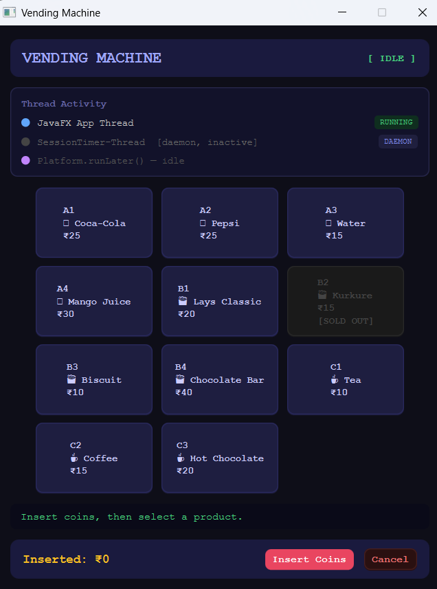
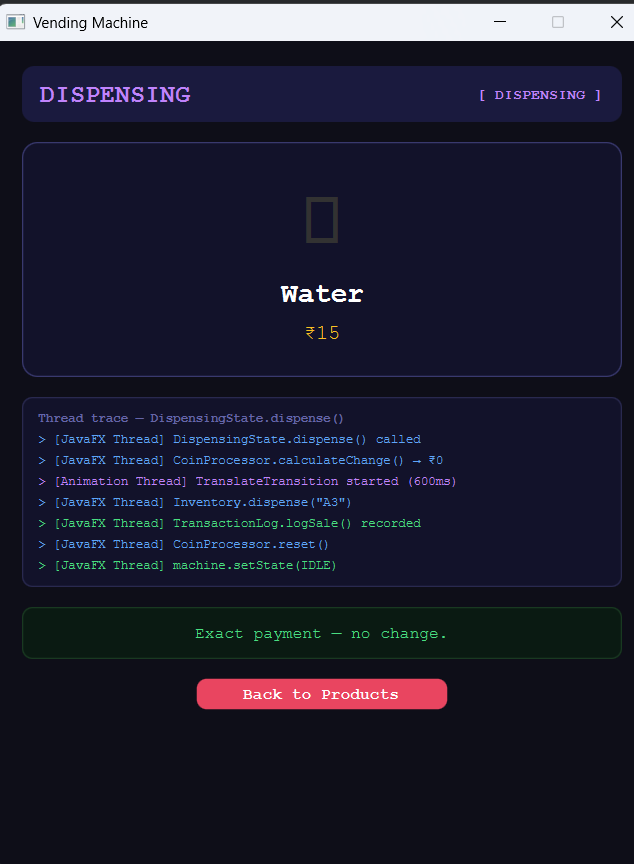

# 🏧 Vending Machine

> A fully functional, animated vending machine simulation built with **Java**, **JavaFX**, and **JUnit 5** — demonstrating the **State Design Pattern**, clean OOP hierarchy, background threading, and real-time UI callbacks.

---

## 📌 Problem Statement

Design and implement a **real-world vending machine** that:

- Accepts valid Indian coin denominations (₹1, ₹2, ₹5, ₹10)
- Maintains product inventory across three categories (Drinks, Snacks, Hot Beverages)
- Transitions safely between machine states (Idle → HasMoney → Dispensing → Idle)
- Calculates and dispenses change using a greedy algorithm
- Auto-cancels sessions after 30 seconds of inactivity (background daemon thread)
- Provides a JavaFX GUI with animations, live thread traces, and a session timer bar
- Logs every transaction (sale, cancel, timeout) for admin reporting

---
## 🛠️ Tech Stack
 
| Layer | Technology |
|---|---|
| Language | Java 17 |
| UI Framework | JavaFX 21 |
| Build Tool | Maven |
| Testing | JUnit 5 |
| Concurrency | `ScheduledExecutorService`, `Platform.runLater()` |
| Data Structures | `HashMap` (Inventory), `ArrayList` (TransactionLog, change coins) |
| Design Pattern | State Pattern, Observer (callbacks) |
| Animations | `TranslateTransition`, `ScaleTransition`, `FadeTransition`, `Timeline` |
 
---
## 🎥 Demo Video

[](https://youtu.be/06QEcSA6M-4)

## 🖥️ Screenshots


<div align="center">

<p>
  
  
</p>

<p>
  
  
</p>

</div>

## 🎯 Use Case

```
User walks up to the machine
  ↓
Inserts coin(s)     → Machine transitions: IDLE → HAS_MONEY
  ↓
Selects product     → Machine validates stock + funds
  ↓
Purchase confirmed  → Machine transitions: HAS_MONEY → DISPENSING
  ↓
Product dispensed   → Change returned, log recorded
  ↓
Machine resets      → DISPENSING → IDLE

Alternate flows:
  • User cancels     → Coins returned, log entry created
  • User walks away  → 30s timeout fires, coins auto-returned
  • Invalid coin     → Rejected, total unchanged
  • Out-of-stock     → Error shown, machine stays in HAS_MONEY
  • Insufficient ₹   → Error shown, machine stays in HAS_MONEY
```

---

## 🏗️ Architecture Overview

```
org.example
├── Main.java                  ← JavaFX entry point
├── VendingMachine.java        ← Central coordinator & callback hub
│
├── ── Product Hierarchy ──────────────────────────────
│   ├── Product.java           ← Abstract base class
│   ├── Drink.java             ← +isCarbonated
│   ├── Snack.java             ← +calories
│   └── HotBeverage.java       ← +brewTimeSeconds
│
├── ── State Pattern ──────────────────────────────────
│   ├── VendingState.java      ← Interface (insertCoin / selectProduct / cancel)
│   ├── IdleState.java         ← Waiting for first coin
│   ├── HasMoneyState.java     ← Coin(s) inserted, awaiting selection
│   └── DispensiongState.java  ← Dispensing in progress (busy)
│
├── ── Core Services ──────────────────────────────────
│   ├── CoinProcessor.java     ← Coin validation + change calculation
│   ├── Inventory.java         ← HashMap-based product store
│   ├── TransactionLog.java    ← Audit trail (SALE / CANCEL / TIMEOUT)
│   └── SessionTimer.java      ← 30s daemon thread via ScheduledExecutorService
│
├── ── JavaFX UI ──────────────────────────────────────
│   ├── Scenemanager.java      ← Screen router (replaces Scene root)
│   ├── Homescreen.java        ← Product grid
│   ├── PaymentScreen.java     ← Coin keypad + timer bar
│   └── Dispensingscreen.java  ← Drop animation + thread trace panel
│
└── ── Tests ──────────────────────────────────────────
    └── VendingMachineTest.java ← 8 JUnit 5 test cases
```

---

## 🎨 Design Pattern — State Pattern

**The heart of this project.** Instead of a monolithic class littered with `if (state == IDLE) {...} else if (state == HAS_MONEY) {...}`, each state is its own class implementing a shared interface.

### Interface

```java
public interface VendingState {
    void insertCoin(int rupees);
    void selectProduct(String productId);
    void cancel();
    String getStateName();
}
```

### State Transition Diagram

```
┌─────────┐   insertCoin()    ┌───────────┐   selectProduct()   ┌─────────────┐
│  IDLE   │ ────────────────▶ │ HAS_MONEY │ ──────────────────▶ │ DISPENSING  │
└─────────┘                   └───────────┘                      └─────────────┘
     ▲                              │                                    │
     │                    cancel()  │                        dispense()  │
     │                              ▼                                    │
     └──────────────────────── coins returned ◀──────────────────────────┘
```

### Why State Pattern?

| Without State Pattern | With State Pattern |
|---|---|
| Giant `if-else` in every method | Each class handles its own logic |
| Adding a new state = editing all methods | Adding a state = add one class |
| Hard to test individual states | Each state class is independently testable |
| Business rules scattered | Rules co-located with the state they belong to |

### Behaviour Matrix

| Action | IDLE | HAS_MONEY | DISPENSING |
|---|---|---|---|
| `insertCoin()` | ✅ Accept, → HAS_MONEY | ✅ Accumulate, reset timer | ❌ "Please wait" |
| `selectProduct()` | ❌ "Insert coins first" | ✅ Validate, → DISPENSING | ❌ "Already dispensing" |
| `cancel()` | ❌ "No transaction" | ✅ Return coins, → IDLE | ❌ "Too late!" |

---

## 💡 Core Algorithm — CoinProcessor

### Coin Validation

Coins are stored in **paise (integer)** to eliminate floating-point errors.

```
Valid denominations: ₹1 (100p), ₹2 (200p), ₹5 (500p), ₹10 (1000p)
Insert ₹3 → rejected (not in valid set)
Insert ₹10 → accepted, insertedAmountPaise += 1000
```

### Greedy Change Algorithm

Calculates change using the **largest denomination first** strategy.

```
Change needed: ₹17
  Step 1: ₹17 ≥ ₹10 → give ₹10 coin,  remaining = ₹7
  Step 2: ₹7  ≥ ₹5  → give ₹5 coin,   remaining = ₹2
  Step 3: ₹2  ≥ ₹2  → give ₹2 coin,   remaining = ₹0
  Result: [₹10, ₹5, ₹2]
```

```java
// Core greedy loop
for (int coinPaise : VALID_COINS_PAISE) {       // [1000, 500, 200, 100]
    while (changePaise >= coinPaise) {
        coins.add(coinPaise / 100);
        changePaise -= coinPaise;
    }
}
```

---

## 🧵 Threading Model

This project uses two threads, with a strict rule: **only the JavaFX Application Thread may touch the UI.**

### Thread 1 — JavaFX Application Thread
Handles all user input, UI updates, animations, and state transitions.

### Thread 2 — `SessionTimer-Thread` (Daemon)
A `ScheduledExecutorService` with a single daemon thread. Fires after 30 seconds of inactivity.

```java
// Daemon thread — dies automatically when app closes
executor = Executors.newSingleThreadScheduledExecutor(r -> {
    Thread t = new Thread(r, "SessionTimer-Thread");
    t.setDaemon(true);
    return t;
});
```

### Critical Bridge — `Platform.runLater()`

When the timer fires on the background thread, it **cannot** touch JavaFX directly. It must queue the work:

```java
private void onTimeout() {
    // Running on: SessionTimer-Thread ← BACKGROUND
    Platform.runLater(() -> {
        // Running on: JavaFX Application Thread ← SAFE
        machine.getCoinProcessor().reset();
        machine.setState(machine.getIdleState());
        machine.notifyCoinsReturned(returned);
    });
}
```

### Timer Lifecycle

```
User inserts coin   → timer.start()   (30s countdown begins)
User inserts again  → timer.reset()   (restarts the 30s)
User buys product   → timer.stop()    (cancelled before dispensing)
30s elapses         → onTimeout()     → Platform.runLater() → coins returned
```

---

## 📦 Product Hierarchy

Polymorphism in action — `Inventory` stores `Product` references; the actual type determines behaviour.

```
Product (abstract)
├── getCategory()     ← abstract, must override
├── isInStock()       ← quantity > 0
├── decrementQuantity()
└── restock(amount)

  ├── Drink          → getCategory() = "DRINK", +isCarbonated
  ├── Snack          → getCategory() = "SNACK", +calories
  └── HotBeverage    → getCategory() = "HOT",   +brewTimeSeconds
```

### Default Inventory

| Slot | Product | Price | Stock | Type |
|---|---|---|---|---|
| A1 | Coca-Cola | ₹25 | 5 | Drink (carbonated) |
| A2 | Pepsi | ₹25 | 5 | Drink (carbonated) |
| A3 | Water | ₹15 | 8 | Drink |
| A4 | Mango Juice | ₹30 | 4 | Drink |
| B1 | Lays Classic | ₹20 | 6 | Snack |
| B2 | Kurkure | ₹15 | **0** | Snack (out of stock) |
| B3 | Biscuit | ₹10 | 7 | Snack |
| B4 | Chocolate Bar | ₹40 | 3 | Snack |
| C1 | Tea | ₹10 | 10 | Hot Beverage |
| C2 | Coffee | ₹15 | 8 | Hot Beverage |
| C3 | Hot Chocolate | ₹20 | 5 | Hot Beverage |

---

## ✅ Test Cases — JUnit 5

All tests are in `VendingMachineTest.java`. Each test uses `@BeforeEach` to get a fresh machine, ensuring full independence.

### Test 1 — Insufficient Funds Rejected
```
Insert ₹10, select A1 (Coca-Cola ₹25)
→ Machine stays in HasMoneyState
→ Inserted amount unchanged (₹10)
```

### Test 2 — Exact Payment Dispenses Successfully
```
Insert ₹10, select C1 (Tea ₹10)
→ Machine transitions to IdleState
→ CoinProcessor resets to ₹0
```

### Test 3 — Change Calculation Correct
```
Insert 5x₹10 (= ₹50), product costs ₹25
→ Change = ₹25
→ Coins: [₹10, ₹10, ₹5]   (3 coins, greedy)
```

### Test 4 — Out-of-Stock Throws Exception
```
Inventory.dispense("B2")   ← Kurkure qty = 0
→ IllegalStateException thrown
```

### Test 5 — State Transition Sequence
```
Start: IdleState
→ insertCoin(5):  HasMoneyState
→ cancel():       IdleState
→ CoinProcessor = ₹0
```

### Test 6 — Session Timeout Resets State
```
Insert ₹10 + ₹10 = ₹20
Simulate onTimeout():
  → TransactionLog.logTimeout(20)
  → CoinProcessor.reset()
  → machine.setState(idle)
→ State = IdleState
→ CoinProcessor = ₹0
→ Last log entry type = "TIMEOUT"
```

### Test 7 — Invalid Coin Rejected
```
CoinProcessor.insertCoin(3)   ← ₹3 is not valid
→ returns false
→ insertedAmount = ₹0
```

### Test 8 — Cannot Select in Idle State
```
No coins inserted, selectProduct("A1")
→ State remains IdleState
→ insertedAmount = ₹0
```

---

## 🖥️ UI Screens

### HomeScreen
- Product grid with emoji icons (🥤 🍟 ☕)
- Out-of-stock products greyed out
- Refreshes after every purchase

### PaymentScreen
- Coin keypad (₹1 / ₹2 / ₹5 / ₹10) with bounce animation
- Live inserted amount display
- Thread indicator label — shows `[JavaFX Thread] insertCoin(₹N) dispatched`
- Session timer bar — visual 30s countdown mirroring `SessionTimer-Thread`

### DispensingScreen
- Product card drop animation (`TranslateTransition`, 650ms)
- Live thread trace panel — shows the sequence of method calls in `DispensingState.dispense()`
- Change amount + coin breakdown

---

## 🔁 Transaction Log

Every event is recorded in `TransactionLog` with a timestamp.

| Type | When |
|---|---|
| `SALE` | Product successfully dispensed |
| `CANCEL` | User pressed Cancel |
| `TIMEOUT` | 30s session expired, coins returned |

```java
machine.getTransactionLog().printAll();
// → 2025-06-01 14:32:11 | SALE    | C1 - Tea     | Paid: ₹10 | Change: ₹0
// → 2025-06-01 14:33:45 | CANCEL  | -  - -       | Paid: ₹25 | Change: ₹25
// → 2025-06-01 14:36:02 | TIMEOUT | -  - -       | Paid: ₹10 | Change: ₹10
```

---

## 🚀 How to Run

### Prerequisites
- Java 17+
- JavaFX SDK 21+
- Maven (for tests)

### Run the App
```bash
mvn javafx:run
```

### Run Tests
```bash
mvn test
```

---

## 📐 Key Design Principles Applied

| Principle | Where |
|---|---|
| **State Pattern** | `VendingState`, `IdleState`, `HasMoneyState`, `DispensiongState` |
| **Open/Closed** | Add a new state by adding a class; existing code untouched |
| **Single Responsibility** | `CoinProcessor` only handles coins; `Inventory` only handles stock |
| **Polymorphism** | `Product` → `Drink` / `Snack` / `HotBeverage` |
| **Thread Safety** | `Platform.runLater()` for all UI updates from background threads |
| **Callback / Observer** | `VendingMachine` exposes `setOnMessage`, `setOnDispensing`, etc. |
| **Greedy Algorithm** | Coin change calculation (largest denomination first) |
